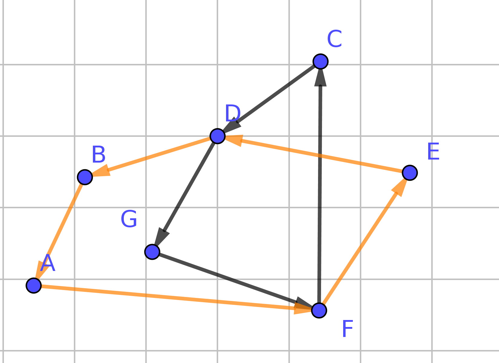

% Bus-Route Optimization
% Jaan Tollander de Balsch
% 2017-11-20
---
header-includes: \usepackage{unicode-math}
bibliography: presentation.bib
---

# Why should we care?
<!--
My name is Jaan Tollander de Balsch
I study at Applied mathematics and computer science
at Aalto university

Today I would like to talk you about bus route optimization.

-->

- Transportation accounts for 5% of the GDP of Europe [@Transpor70:online]
- Estimated 30 percent of national greenhouse gases are generated by transportation
- People spent significant amounts of time in public transportation. For example in France more than 60 minutes daily. [@Parisian44:online]

<!--
This means that optimizing the routes for vechicles, such as buses, can have large impact for saving time, money and the environment.
-->

# How can bus-routes be optimized?
<!--
mathematical optimization can be used to create efficient bus routings for bus networks. I will tell you about how problem of this kind are formulated and how they can be solved.
-->

\[
{\begin{aligned}&
{\underset{x}{\mathrm{minimize} }}&&f(x)\\
&\mathrm{subject\;to} &&g_{i}(x)\leq 0,\quad i=1,\dots ,m\\&&&h_{i}(x)=0,\quad i=1,\dots ,p
\end{aligned}}
\]

- **Mathematical optimization methods** can be used for the creation of efficient bus networks
- Requires formulating the bus routing problem mathematically
- Choose the best numerical method for optimization

# Main Points of the Talk

<!-- This talk is divided into three part. -->
1) How to formulate the bus-routing problem
<!-- First, we'll talk why bus-route optimization is useful and important.  -->
2) How the optimization process works
<!-- Then we'll move on to the how the optimization works and what kinda of data is needed to obtain real life values for the solution. -->
3) The benefits of bus-route optimization
<!-- Lastly we'll conclude the how bus-route optimization can benefit both, the providers and the customers. -->

# Formulation
<!-- In order to formulate the bus-routing problem we need to define ...  -->
1) **Objective**: Minimize the *cost function*, which can include
    <!-- consists of -->
    - Monetary cost to operate the network
    - Total travel time
    <!-- essentially whatever we define it to be as long as we obtain solutions satisfactory solutions -->
2) **Constraints**: What kinda of features we want to avoid in our network
    - Avoid too long or inconvenient routes
3) Real life data to obtain numerical estimates for the parameters
    - Common travel routes
    - Distribution of the population in the city

[@RouteOpt71:online], [@Vehicler42:online],

# Example Network

# Methods
<!--
Now that we have looked at the the data required to formulate the bus-routing problem, I am going to explain how is the actual optimization is performed. We are going to look at optimization methods and existing solvers ...
-->

<!--
Widely used option to obtains solution to bus-routing problem is to use genetic algorithm, which is optimization technique that borrows its working principles from the process of evolution. The main steps of this algorithm are:
-->

**Genetic optimization algorithm** [@Genetica54:online]

1) Initializing a *population* which is set of possible *routing candidates* (individual bus network)
2) Computing the *fitness* of each of the individual routings in the population which measure how good each routing is
3) Selecting a percentage of the best performing individuals and using them to *reproduce* new individuals
4) We also apply a random mutation on randomly selected individuals to avoid getting stuck in the local optimum
5) Use process recursively

Existing solvers, such as Gurobi, can be to perform the optimization. [@GurobiOp41:online]

# Benefits

<!--
So now that we understand what is required for bus-route optimization and how it can be solved, lets review the benefits of the obtained solutions

- The benefits of using bus-route optimization
- Potential savings in time, money and the environmental impact
-->

- Savings in transportation time
- Economical impact, saving money
- Positive environmental impact, less greenhouse gases

# Conclusion
<!--
Summarize the main points:

Now that we understand what bus-route optimization consists of and how it can be solved and we have looked at the benefits for saving time and money as well as the positive environmental impact we can conclude that bus-route optimization is investment that is well worth it. -->

- We learned
    - What bus-routing probelm consists of
    - How it is solved
    - About the positive effects of good bus-routing
- Proper bus-routing is important for functioning public transportation
- Well designed bus network can impact your daily life by saving time!

<!--
**Return to the story, problem or question:** ...

How much money can be saved, the effects of improving the solution by ...
-->

# References
